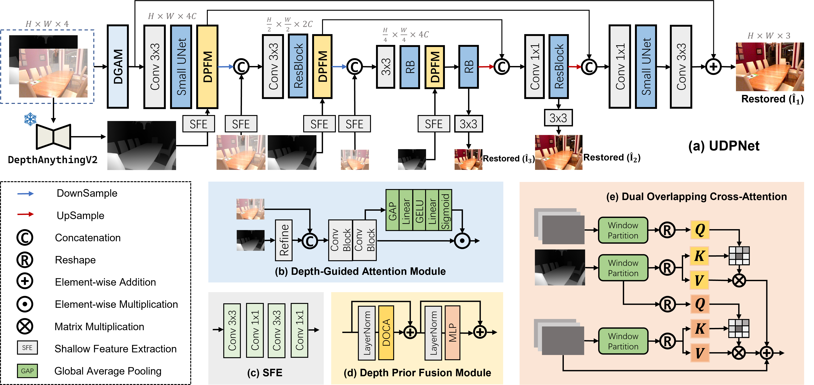

# UDPNet: Unleashing Depth-based Priors for Robust Image Dehazing

This repository contains the official implementation of the following paper:
> UDPNet: Unleashing Depth-based Priors for Robust Image Dehazing 
> [Zengyuan Zuo](), [Junjun Jiang](http://homepage.hit.edu.cn/jiangjunjun), [Gang Wu](https://me.csgwu.site/), [Xianming Liu](http://homepage.hit.edu.cn/xmliu)*    

[AIIA Lab](https://aiialabhit.github.io/team/), Faculty of Computing, Harbin Institute of Technology, Harbin 150001, China.

**Paper Link:** [[official link](https://arxiv.org/abs/2601.06909)] 

## Overview

## Installation
The project is built with PyTorch 3.8, PyTorch 1.8.1. CUDA 10.2, cuDNN 7.6.5
For installing, follow these instructions:
~~~
conda install pytorch=1.8.1 torchvision=0.9.1 -c pytorch
pip install tensorboard einops scikit-image pytorch_msssim opencv-python
conda install pillow
~~~
**Please use the *pillow* package downloaded by Conda instead of pip.**

Install warmup scheduler:
~~~
cd pytorch-gradual-warmup-lr/
python setup.py install
cd ..
~~~

## Prepare pretrained models

**Download Links:**

## Results

📊 <strong>Synthetic Benchmarks</strong>

 
Table 1. SOTS-Indoor & SOTS-Outdoor

| Method                  | Venue    | Indoor PSNR | Indoor SSIM | Outdoor PSNR | Outdoor SSIM |
| ----------------------- | -------- | ----------- | ----------- | ------------ | ------------ |
| DCP                     | TPAMI'10 | 16.61       | 0.855       | 19.14        | 0.861        |
| FFA-Net                 | AAAI'20  | 36.39       | 0.989       | 33.57        | 0.984        |
| AECR-Net                | CVPR'21  | 37.17       | 0.990       | -            | -            |
| DeHamer                 | CVPR'22  | 36.63       | 0.988       | 35.18        | 0.986        |
| DehazeFormer-L          | TIP'23   | 40.05       | 0.996       | -            | -            |
| FSNet **(Baseline)**    | TPAMI'23 | 42.45       | 0.997       | 40.40        | 0.997        |
| MB-TaylorFormer-L       | ICCV'23  | 42.64       | 0.994       | 38.09        | 0.991        |
| FocalNet                | ICCV'23  | 40.82       | 0.996       | 37.71        | 0.995        |
| C²PNet                  | CVPR'23  | 42.56       | 0.995       | 36.68        | 0.990        |
| DEA-Net-CR              | TIP'24   | 41.31       | 0.995       | 36.59        | 0.990        |
| DCMPNet                 | CVPR'24  | 42.18       | 0.997       | 36.56        | 0.993        |
| GridFormer              | IJCV'24  | 42.34       | 0.994       | -            | -            |
| ConvIR-B **(Baseline)** | TPAMI'24 | 42.72       | 0.997       | 39.42        | 0.996        |
| SFMN                    | TIP'25   | 41.44       | 0.995       | 37.72        | 0.991        |
| PoolNet-B               | TIP'25   | 42.01       | 0.997       | -            | -            |
| PGH²Net                 | AAAI'25  | 41.70       | 0.996       | 37.52        | 0.989        |
| MB-TaylorFormerV2-L     | TPAMI'25 | 42.84       | 0.995       | 39.25        | 0.992        |
| **ConvIR + UDP (Ours)** | –        | 43.12       | 0.997       | 40.32        | 0.996        |
| **FSNet + UDP (Ours)**  | –        | **43.30**   | **0.997**   | **40.53**    | **0.997**    |

 
Table 2. Haze4K

| Method                  | PSNR      | SSIM     |
| ----------------------- | --------- | -------- |
| DehazeNet               | 19.12     | 0.84     |
| GridDehazeNet           | 23.29     | 0.93     |
| FFA-Net                 | 26.96     | 0.95     |
| DMT-Net                 | 28.53     | 0.96     |
| PMNet                   | 33.49     | 0.98     |
| MB-TaylorFormer-L       | 34.47     | 0.99     |
| FSNet **(Baseline)**    | 34.12     | 0.99     |
| GridFormer              | 33.27     | 0.99     |
| ConvIR-B **(Baseline)** | 34.15     | 0.99     |
| DEA-Net-CR              | 34.25     | 0.99     |
| MB-TaylorFormerV2-B     | 34.92     | 0.99     |
| **ConvIR + UDP (Ours)** | 34.82     | 0.99     |
| **FSNet + UDP (Ours)**  | **35.31** | **0.99** |

🌙 <strong>Nighttime Dehazing</strong>

 
Table 3. GTA5

| Method                   | PSNR      | SSIM      |
| ------------------------ | --------- | --------- |
| GS                       | 21.02     | 0.639     |
| MRP                      | 20.92     | 0.646     |
| Ancuti et al.            | 20.59     | 0.623     |
| Yan et al.               | 27.00     | 0.850     |
| CycleGAN                 | 21.75     | 0.696     |
| Jin et al.               | 30.38     | 0.904     |
| ConvIR-B **(Baseline)**  | 31.83     | 0.921     |
| PoolNet-B **(Baseline)** | 31.53     | 0.921     |
| PoolNet + UDP            | 32.78     | 0.930     |
| **ConvIR + UDP**         | **33.12** | **0.933** |

 
Table 4. NHR
 

| Method                  | PSNR      | SSIM      |
| ----------------------- | --------- | --------- |
| NDIM                    | 14.31     | 0.526     |
| GS                      | 17.32     | 0.629     |
| MRPF                    | 16.95     | 0.667     |
| MRP                     | 19.93     | 0.777     |
| OSFD                    | 21.32     | 0.804     |
| HCD                     | 23.43     | 0.953     |
| FocalNet                | 25.35     | 0.969     |
| Jin et al.              | 26.56     | 0.890     |
| FSNet **(Baseline)**    | 26.30     | 0.976     |
| ConvIR-B **(Baseline)** | 29.49     | 0.983     |
| PoolNet-B               | 28.28     | 0.980     |
| FSNet + UDP             | 28.09     | 0.980     |
| **ConvIR + UDP**        | **29.54** | **0.983** |

🏞️<strong>Real-World Image Dehazing</strong>

 
Table 5. Dense-Haze & NH-HAZE

| Method                  | Dense PSNR | Dense SSIM | Dense LPIPS | NH PSNR   | NH SSIM  | NH LPIPS   |
| ----------------------- | ---------- | ---------- | ----------- | --------- | -------- | ---------- |
| DehazeNet               | 13.84      | 0.43       | -           | 16.62     | 0.52     | -          |
| MSBDN                   | 15.37      | 0.49       | -           | 19.23     | 0.71     | -          |
| DeHamer                 | 16.62      | 0.56       | 0.6346      | 20.66     | 0.68     | 0.3837     |
| PMNet                   | 16.79      | 0.51       | -           | 20.42     | 0.73     | -          |
| MB-TaylorFormer-B       | 16.66      | 0.56       | 0.6125      | -         | -        | -          |
| C²PNet                  | 16.88      | 0.57       | -           | 20.24     | 0.69     | -          |
| FocalNet                | 17.07      | 0.63       | 0.6087      | 20.43     | 0.79     | 0.3780     |
| SFNet                   | 17.46      | 0.58       | **0.5689**  | 20.46     | 0.80     | -          |
| FSNet **(Baseline)**    | 17.13      | 0.65       | 0.5756      | 20.55     | 0.81     | 0.3624     |
| ConvIR-S **(Baseline)** | 17.45      | 0.65       | 0.6000      | 20.65     | 0.80     | 0.3669     |
| **ConvIR + UDP**        | 17.55      | **0.67**   | 0.5813      | **20.98** | **0.82** | **0.3567** |
| **FSNet + UDP**         | **17.85**  | 0.65       | 0.6033      | 20.94     | 0.82     | 0.3732     |

🌍<strong>Remote Sensing Image Dehazing</strong>

 
Table 6. Remote Sensing Dehazing

| Method                   | Thin PSNR | Thin SSIM | Moderate PSNR | Moderate SSIM | Thick PSNR | Thick SSIM |
| ------------------------ | --------- | --------- | ------------- | ------------- | ---------- | ---------- |
| AOD-Net                  | 19.54     | 0.854     | 20.10         | 0.885         | 15.92      | 0.731      |
| H2RL-Net                 | 20.91     | 0.880     | 22.34         | 0.906         | 17.41      | 0.768      |
| FCFT-Net                 | 23.59     | 0.913     | 22.88         | 0.927         | 20.03      | 0.816      |
| C²PNet                   | 19.62     | 0.880     | 24.79         | 0.940         | 16.83      | 0.790      |
| Restormer                | 23.08     | 0.912     | 24.73         | 0.933         | 18.58      | 0.762      |
| Trinity-Net              | 21.55     | 0.884     | 23.35         | 0.895         | 20.97      | 0.823      |
| UMWTransformer           | 24.29     | 0.919     | 26.65         | 0.946         | 20.07      | 0.825      |
| FocalNet                 | 24.16     | 0.916     | 25.99         | 0.947         | 21.69      | 0.847      |
| ConvIR-S **(Baseline)**  | 25.11     | 0.978     | 26.79         | 0.978         | 22.65      | 0.950      |
| PoolNet-S **(Baseline)** | 25.02     | 0.979     | 27.02         | 0.979         | 22.73      | **0.955**  |
| **ConvIR + UDP**         | 25.48     | 0.979     | 28.07         | **0.981**     | 22.95      | 0.953      |
| **PoolNet + UDP**        | **26.20** | **0.980** | **28.26**     | 0.979         | **23.13**  | 0.951      |

🧪 <strong>All-in-One Image Restoration Benchmarks</strong>

 
Table 7. Performance on Five Challenging Benchmarks

| Method                    | Dehaze    |           | Derain    |           | Denoise   |           | Deblur    |           | Low-Light |           | Average   |           |
| ------------------------- | --------- | --------- | --------- | --------- | --------- | --------- | --------- | --------- | --------- | --------- | --------- | --------- |
|                           | PSNR      | SSIM      | PSNR      | SSIM      | PSNR      | SSIM      | PSNR      | SSIM      | PSNR      | SSIM      | PSNR      | SSIM      |
| DehazeFormer (TIP’23)     | 25.31     | 0.937     | 33.68     | 0.954     | 30.89     | 0.880     | 25.93     | 0.785     | 21.31     | 0.819     | 27.42     | 0.875     |
| Retinexformer (ICCV’23)   | 24.81     | 0.933     | 32.68     | 0.940     | 30.84     | 0.880     | 25.09     | 0.779     | 22.76     | 0.863     | 27.24     | 0.873     |
| SwinIR (ICCVW’21)         | 21.50     | 0.891     | 30.78     | 0.923     | 30.59     | 0.868     | 24.52     | 0.773     | 17.81     | 0.723     | 25.04     | 0.835     |
| Restormer (CVPR’22)       | 24.09     | 0.927     | 34.81     | 0.960     | 31.49     | 0.884     | 27.22     | 0.829     | 20.41     | 0.806     | 27.60     | 0.881     |
| FSNet (TPAMI’23)          | 25.53     | 0.943     | 36.07     | 0.968     | 31.33     | 0.883     | 28.32     | 0.869     | 22.29     | 0.829     | 28.71     | 0.898     |
| TransWeather (CVPR’22)    | 21.32     | 0.885     | 29.43     | 0.905     | 29.00     | 0.841     | 25.12     | 0.757     | 21.21     | 0.792     | 25.22     | 0.836     |
| AirNet (CVPR’22)          | 21.04     | 0.884     | 32.98     | 0.951     | 30.91     | 0.882     | 24.35     | 0.781     | 18.18     | 0.735     | 25.49     | 0.846     |
| PromptIR **(Baseline)**   | 26.54     | 0.949     | 36.37     | 0.970     | **31.47** | 0.886     | 28.71     | 0.881     | 22.68     | 0.832     | 29.15     | 0.904     |
| AdaIR **(Baseline)**      | 30.53     | 0.978     | *38.02*   | *0.981*   | 31.35     | *0.889*   | 28.12     | 0.858     | 23.00     | 0.845     | 30.20     | 0.910     |
| DCPT-PromptIR             | 30.72     | 0.977     | 37.32     | 0.978     | 31.32     | 0.885     | *28.84*   | *0.877*   | *23.35*   | 0.840     | 30.31     | 0.911     |
| DA-RCOT                   | 30.96     | 0.975     | 37.87     | 0.980     | 31.23     | 0.888     | 28.68     | 0.872     | 23.25     | 0.836     | *30.40*   | 0.911     |
| Perceive-IR               | 28.19     | 0.964     | 37.25     | 0.977     | *31.44*   | 0.887     | **29.46** | **0.886** | 22.88     | 0.833     | 29.84     | 0.909     |
| Pool-AIO                  | 30.25     | 0.977     | 37.85     | 0.981     | 31.24     | 0.887     | 27.66     | 0.844     | 22.66     | 0.841     | 29.93     | 0.906     |
| DPPD-PromptIR             | 30.31     | 0.980     | 37.32     | 0.980     | 31.33     | 0.885     | 28.74     | 0.875     | 22.73     | 0.846     | 30.09     | *0.913*   |
| VLU-Net                   | 30.84     | 0.980     | **38.54** | **0.982** | 31.43     | **0.891** | 27.46     | 0.840     | 22.29     | 0.833     | 30.11     | 0.905     |
| **PromptIR + UDP (Ours)** | *31.33*   | *0.980*   | 37.63     | 0.980     | 31.25     | 0.883     | 28.34     | 0.868     | 23.18     | *0.851*   | 30.35     | 0.912     |
| **AdaIR + UDP (Ours)**    | **31.41** | **0.980** | 37.85     | 0.980     | 31.28     | 0.888     | 28.62     | 0.870     | **23.53** | **0.854** | **30.55** | **0.915** |

